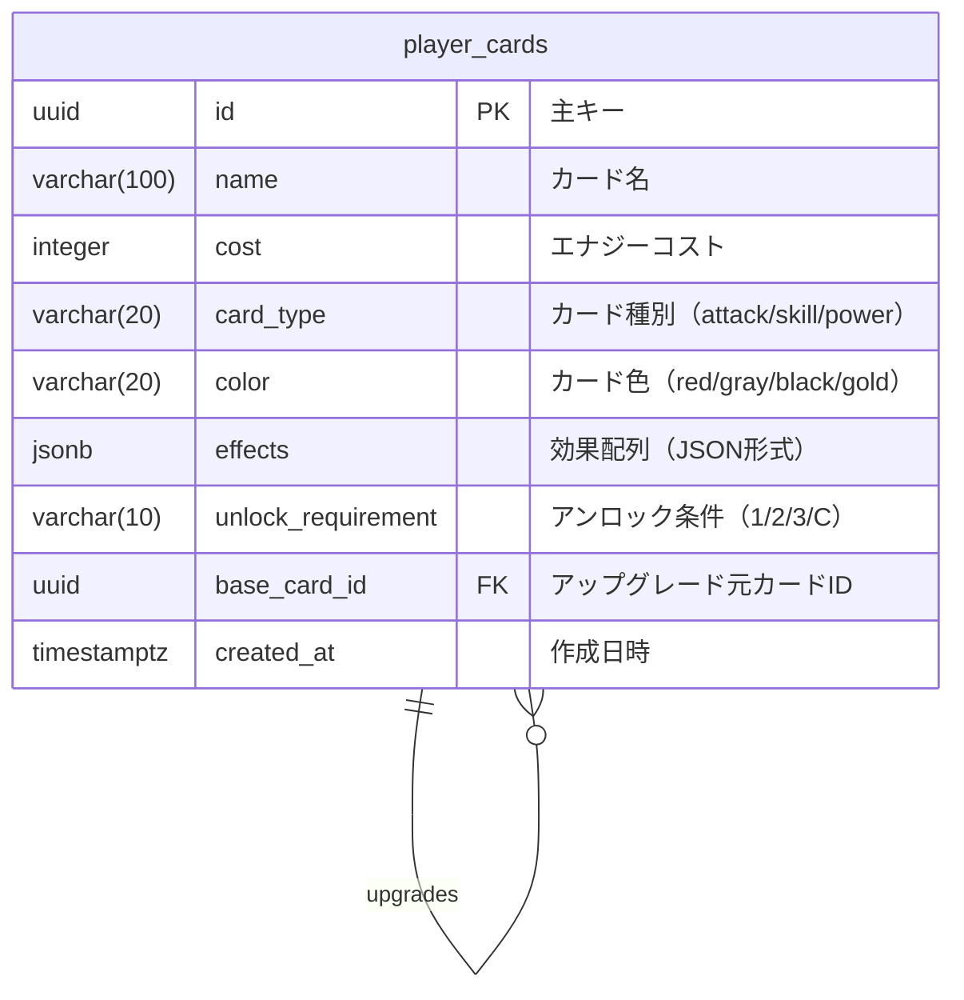

# データベーススキーマ仕様

このドキュメントは、spire-boardプロジェクトのデータベーススキーマを定義します。

## 目次

- [ER図](#er図)
- [テーブル一覧](#テーブル一覧)
- [マイグレーション](#マイグレーション)

---

## ER図



**リレーション説明:**
- `player_cards.base_card_id` → `player_cards.id`: アップグレード版カードはベースカードを参照

---

## テーブル一覧

### `player_cards`

デッキ構築ゲームプレイ用のプレイヤーカード定義を保存します。

#### カラム定義

| カラム名 | 型 | NULL許可 | デフォルト値 | 説明 |
|---------|-----|---------|------------|------|
| `id` | UUID | NOT NULL | `gen_random_uuid()` | 主キー |
| `name` | VARCHAR(100) | NOT NULL | - | カード名（例: "やせ我慢"） |
| `cost` | INTEGER | NOT NULL | - | エナジーコスト（0以上） |
| `card_type` | VARCHAR(20) | NOT NULL | - | カード種別（`attack`, `skill`, `power`） |
| `color` | VARCHAR(20) | NOT NULL | - | カード色（`red`, `gray`, `black`, `gold`） |
| `effects` | JSONB | NOT NULL | `'[]'::jsonb` | 効果配列（JSON形式） |
| `unlock_requirement` | VARCHAR(10) | NULL | - | アンロック条件（`1`, `2`, `3`, `C`） |
| `base_card_id` | UUID | NULL | - | アップグレード元カードID（NULL=ベースカード） |
| `created_at` | TIMESTAMPTZ | NOT NULL | `NOW()` | 作成日時 |

#### 制約

- **主キー**: `id`
- **CHECK制約**:
  - `cost >= 0`
  - `card_type IN ('attack', 'skill', 'power')`
  - `color IN ('red', 'gray', 'black', 'gold')`
  - `unlock_requirement IN ('1', '2', '3', 'C')` (NULLも許可)
- **外部キー**: `base_card_id` → `player_cards(id)` (ON DELETE CASCADE)

#### インデックス

| インデックス名 | カラム | 種類 | 目的 |
|--------------|--------|------|------|
| `idx_player_cards_base_card_id` | `base_card_id` | B-tree | アップグレード版検索 |
| `idx_player_cards_color` | `color` | B-tree | 色別フィルタリング |
| `idx_player_cards_type` | `card_type` | B-tree | 種別別フィルタリング |
| `idx_player_cards_cost` | `cost` | B-tree | コスト範囲検索 |
| `idx_player_cards_effects` | `effects` | GIN | 効果内容の全文検索 |

#### `effects` JSONBフィールドの形式

効果は配列形式で保存され、各効果は以下の構造を持ちます：

```json
[
  {
    "type": "block",
    "value": 3,
    "target": "any_player"
  },
  {
    "type": "add_to_deck",
    "card": "dizziness",
    "position": "top",
    "target": "self"
  }
]
```

**共通フィールド:**
- `type` (string, 必須): 効果タイプ（例: `block`, `damage`, `add_to_deck`）
- `target` (string, 必須): 対象（例: `self`, `any_player`, `all_enemies`）
- `value` (integer, オプション): 数値パラメータ（ダメージ量、ブロック量など）
- その他のフィールド: 効果タイプ固有のメタデータ

**効果タイプの例:**
- `block`: ブロック付与
- `damage`: ダメージ
- `add_to_deck`: デッキにカードを追加
- `draw`: ドロー
- `energy`: エナジー増加

#### データ例

**ベースカード（やせ我慢）:**
```json
{
  "id": "550e8400-e29b-41d4-a716-446655440000",
  "name": "やせ我慢",
  "cost": 1,
  "card_type": "skill",
  "color": "red",
  "effects": [
    {
      "type": "block",
      "value": 3,
      "target": "any_player"
    },
    {
      "type": "add_to_deck",
      "card": "dizziness",
      "position": "top",
      "target": "self"
    }
  ],
  "unlock_requirement": null,
  "base_card_id": null,
  "created_at": "2026-01-03T12:00:00Z"
}
```

**アップグレード版カード（やせ我慢+）:**
```json
{
  "id": "660e8400-e29b-41d4-a716-446655440001",
  "name": "やせ我慢+",
  "cost": 1,
  "card_type": "skill",
  "color": "red",
  "effects": [
    {
      "type": "block",
      "value": 5,
      "target": "any_player"
    },
    {
      "type": "add_to_deck",
      "card": "dizziness",
      "position": "top",
      "target": "self"
    }
  ],
  "unlock_requirement": null,
  "base_card_id": "550e8400-e29b-41d4-a716-446655440000",
  "created_at": "2026-01-03T12:00:00Z"
}
```

---

## マイグレーション

### マイグレーション形式

このプロジェクトではSQLxの**可逆マイグレーション**（up/down形式）を使用しています。

**ファイル命名規則:**
- `{timestamp}_{description}.up.sql` - 前進マイグレーション
- `{timestamp}_{description}.down.sql` - ロールバック用

**例:**
- `20260103074252_create_player_cards.up.sql`
- `20260103074252_create_player_cards.down.sql`

### マイグレーション操作

```bash
# 全マイグレーション適用
sqlx migrate run

# 最新のマイグレーションを1つロールバック
sqlx migrate revert

# マイグレーション履歴確認（_sqlx_migrationsテーブル）
psql -d spire_board -c "SELECT * FROM _sqlx_migrations ORDER BY installed_on DESC;"
```

### 既存マイグレーション

#### 1. `20260103074252_create_player_cards`

- **作成日**: 2026-01-03
- **説明**: player_cardsテーブルの作成
- **up**: テーブル、インデックス、コメントを作成
- **down**: テーブルを削除（CASCADE）

---

## 今後の拡張予定

以下のテーブルが将来追加される予定です：

- `event_cards` - イベントカード
- `item_cards` - アイテムカード
- `game_runs` - ゲーム進行状況
- `player_state` - プレイヤー状態（HP、エナジーなど）
- `map_nodes` - マップノード定義
- `enemy_definitions` - 敵の定義

---

**最終更新**: 2026-01-03
**バージョン**: 1.0.0
